# Sarah Larimer 
# DATA 146 Extra Credit
# Nov. 13, 2020

## Data
The data used in this project describe demographic information about a population in Liberia. This information came from a household survey which describes factors such as location, age, wealth, gender, and education. Initially, we were looking for a model that would best predict education based on the other factors. 
In Figure 1, you can see a pairplot of the different demographic factors. Higher numbers indicate higher levels of education and wealth whereas lower numbers indicate lower levels. Not all the data are equally distributed in each category either. For example, looking at the histogram of age you can see that the survey included more young than old. 

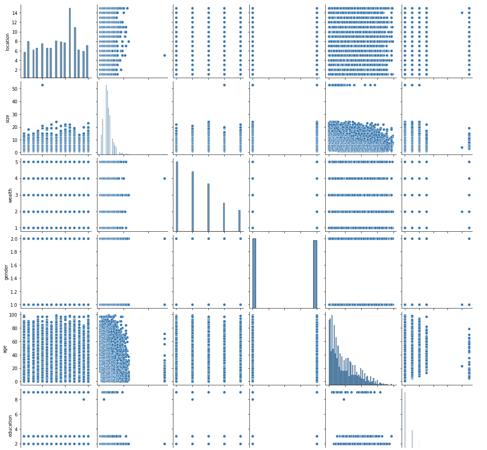 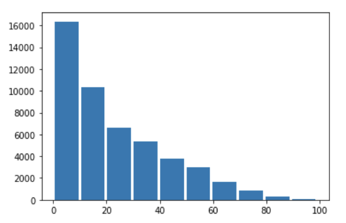

The first thing I did to get  a better sense of the data was to see if there were initially any features that were highly correlated. I created a heat map to see this information. None of the features presented a particularly strong individual correlation.

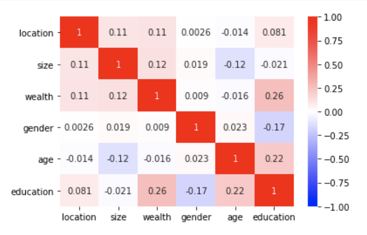

I also performed PCA on the unstandardized(L) and standardized(R) data in order to see how much variance could be explained by the principal components. This is shown by the scree plots below

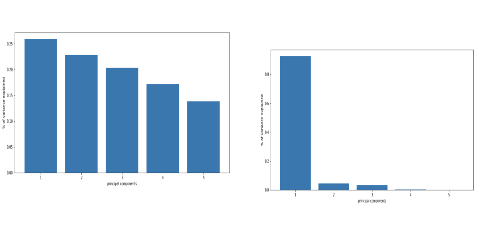

##Analysis
The first approach of creating and testing models was to look at a logistic regression. The initial step in this process was to split the data into training and testing sets. Once that was done, I could do the regression. The first regression done on the raw data produced an accuracy score of 0.57. 
Accuracy = 0.57
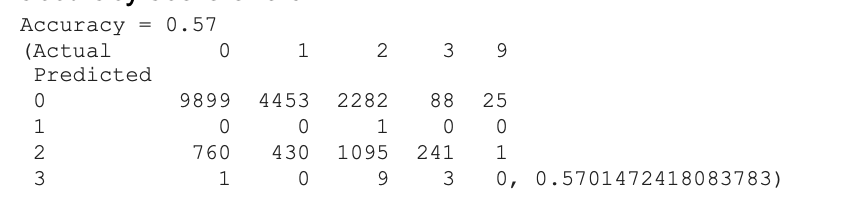

As you can see in the confusion matrix, this first logistic regression failed to predict the 9 category of education. 
### Standardization/Normalization
The next step was to try different modes of standardizing and normalizing the data to see if the regression would perform better. 

Standard Scaler and Min Max Scaler produced similar results:
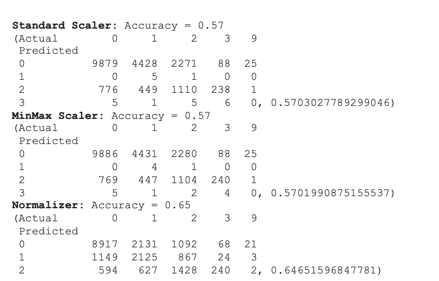

The normalizer gave the best results. However, as you can see, none of the different logistic regression models were a particularly good predictor of the data. All of them failed to predict the 9 category of education and Normalizer, although giving the best score, failed to predict the 3 category as well. 
### kNN Model
After trying a logistic regression, I tried to do a kNN model. Because the data should be standardized for kNN, I tried to do it with both Standard Scaler as well as the Normalizer. For both of the kNN models, I used a for loop to try and find the best value for k. 

For the Standard Scaler version, I got a max testing score of 0.7031. This also corresponded to the value for k that gave me the least overfit model (the smallest difference between corresponding training/testing scores), with a training score of 0.737. While this resulted in a higher score than any of the logistic regression models, it is important to note that the model is still overfit. 

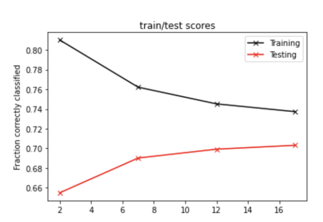

For the Normalizer standardization version, I got a max testing score of .6648 and a corresponding training score of approximately .710. On a whole, this model did worse than the model that used standard scaler as it’s method of data standardization. 

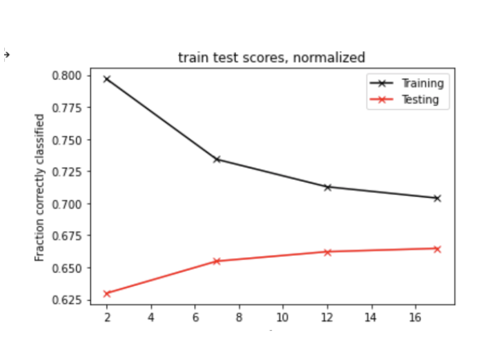

However, for both of these models I initially used a range of 2-18 as my k-value. Upon seeing that the training and testing scores began to converge in both models, I retested using a k-range of (10,100) using intervals of 10. I only re-tested the standard-scalar version because that as a whole performed better than the kNN that used the normalizer. 

As a result of doing this, I was able to achieve a testing score of 0.701 and a corresponding training score of 0.711. While this is a slight decrease in the testing accuracy from the initial SS kNN, it is also a less overfit model. This final kNN model was a result of a k-value of 60. 

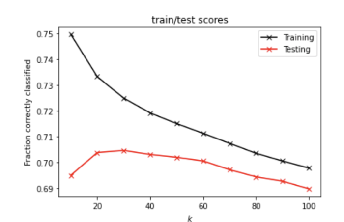

As you can see, the training scores drastically decreased in this model as the number of neighbors increased. As the number of neighbors increases, both training and testing decrease at similar rates and stay a relatively similar distance apart. Because of this, I chose k=60 as the best model because it is the highest scores that are also relatively not over-fit. 

### Decision Tree
The next thing to do was to investigate this data by creating a model from a decision tree. Similar to varying k-neighbors in the kNN model, for the decision tree I looped over different values for max_depth. 

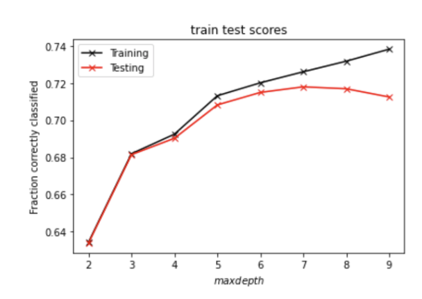

After producing the data for the training and testing scores, I concluded that the best max_depth for the decision tree model was 6. Although the score for 7 was slightly higher, it was also more overfit. 

With this model I achieved a testing score of 0.702 and a training score of 0.715. 

### Random Forest
The next step in the creation of a model is to combine decision trees and use a Random Forest model. For random forest, not old did I vary the number of estimators but also the max_depth for each of those estimators. I looped over a max_depth of 2-9 and a number of iterators 2-48. 

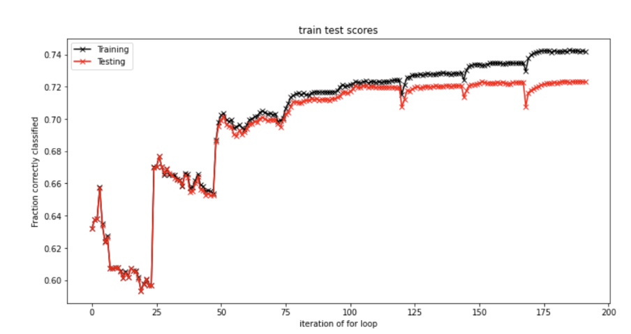

I wanted to visualize my results so I graphed the train and test scores over iterations through the loop (192 total). Although this is not the best graph I could generate, one can calculate the max_depth/estimators combination through modular arithmetic. 

The combination that I found to produce the best scores with the least overfitting was a max_depth of 8 and a n_estimators of 33. This produced a test score of 0.7219 and a training score of 0.7333. 

### Using Education Instead of Wealth
After testing models with Education as the target, I also tested for Wealth as the target. Because my Random Forest was the best model, I started with this as the model I would test, this time using wealth as the target. After running my Random Forest, I didn’t get very good results. Training accuracy never reached .5 and testing accuracy plateaued around .4 when I looped across max_depth and n_iterators all the way up to 10 and 50 respectively. 

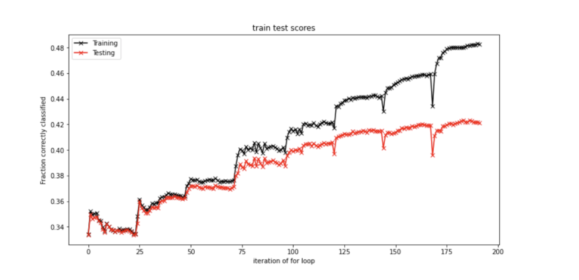

## Conclusions
After my analysis, I would say that my RFC did the best job at predicting education based off of the other factors. This was based on the training and testing scores I achieved through my analysis. Overall, it makes sense that demographic information such as age, gender, and wealth could predict something such as education decently accurately. If I were to continue to do more tests in the future, it would be interesting to look at more demographic information from the household survey and see if there were any additional demographic factors that could serve as indicators of education and help strengthen my model. 

All of my code can be found through Google CoLab here: https://colab.research.google.com/drive/1eig5ughmNzuaMA-Ttmm569CSZZwuzXWD?usp=sharing
